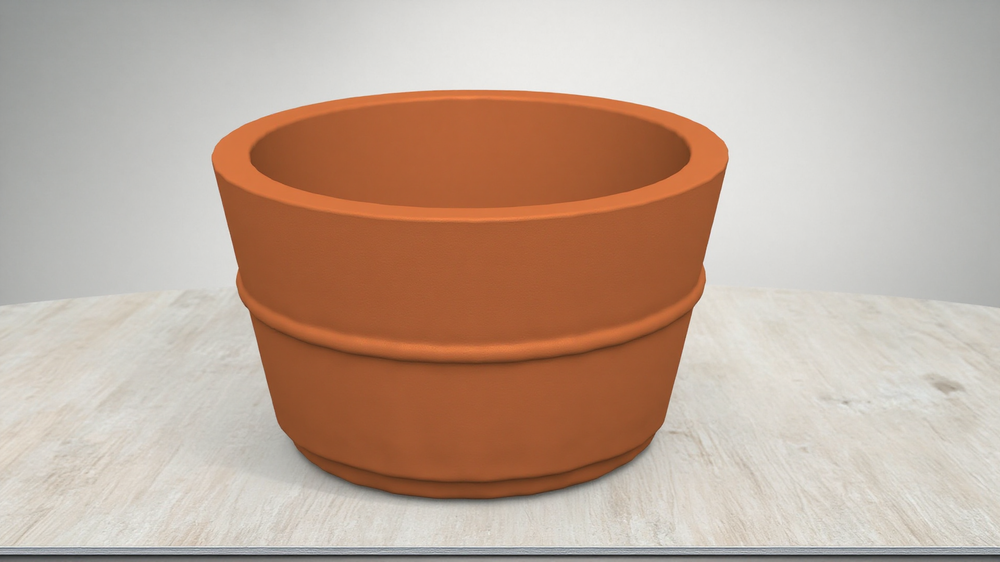
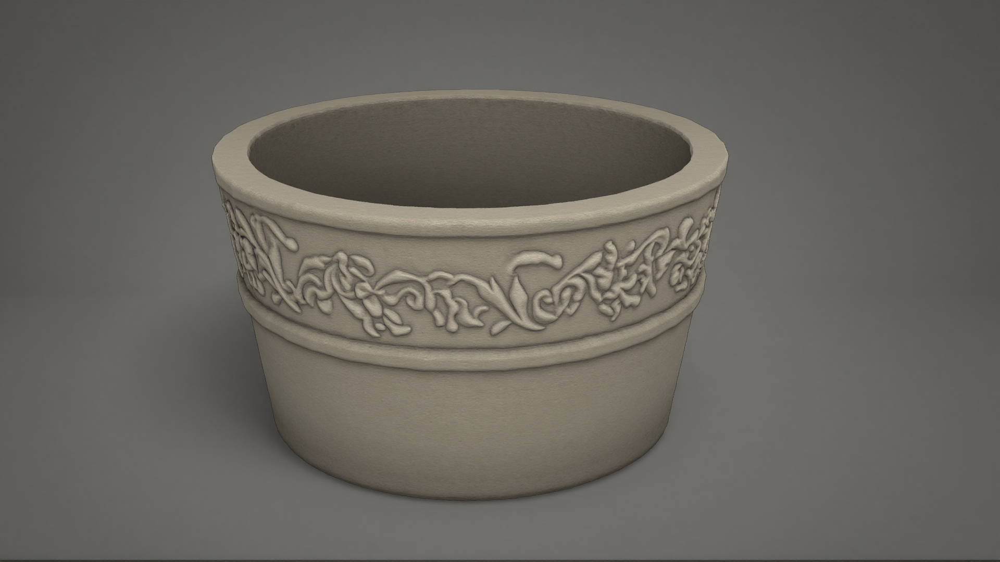
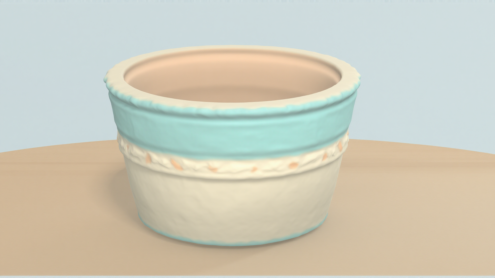
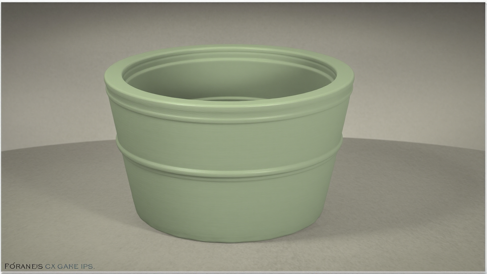

# BloomForge
## AI-Assisted Stylized Game Prop Pipeline

BloomForge is a self-directed technical art study exploring how artist-created Blender geometry and depth-conditioned generative AI can accelerate visual iteration while retaining structural control.

## From Blender to material exploration

| 1. Authored Blender planter | → 2. Geometry-derived Mist/depth | → 3. FLUX.1 Depth result |
| --- | --- | --- |
|  |  |  |

The Blender model sets the shape and camera view. Its Mist pass supplies structural guidance to FLUX.1 Depth; the result explores a cream ceramic finish while retaining the planter's main form. Shallow flower relief is a documented limitation below.

**Inspect the evidence:** [Blender source](blender/BloomForge_Planter.blend) · [ComfyUI workflow](comfyui/bloomforge_flux_depth_workflow.json) · [Generated PNG with embedded prompt and workflow metadata](renders/generated/neutral_ceramic.png).

## Overview

This is not text-to-image asset generation from scratch. The workflow begins with authored 3D geometry and uses a geometry-derived depth image to guide visual exploration. The generated results are references for artist evaluation, not finished game assets.

## Pipeline

Blender Geometry → Geometry-Derived Depth → FLUX.1 Depth / ComfyUI → Visual Material Exploration → Artist Evaluation → Production Refinement

## Goals

Test where AI-assisted workflows can genuinely accelerate game-asset visual iteration, and identify where their control signals fall short. The aim is to keep the artist's geometry and judgment central to the process.

## Tools

- Blender
- ComfyUI
- FLUX.1 Depth Dev
- Git

## Experiment

I modeled an original planter in Blender and rendered a geometry-derived Mist/depth pass. In ComfyUI, the Mist image was inverted to the near-bright depth convention expected by the FLUX.1 Depth workflow, then used as structural conditioning. Material directions included cream ceramic, cobalt blue glaze with gold accents, terracotta, aged stone, hand-painted ceramic, and matte sage green paint.

Additional material directions using the same depth-guided workflow:

| Material direction | Generated study |
| --- | --- |
| Cobalt blue glaze and gold |  |
| Terracotta |  |
| Aged stone |  |
| Hand-painted ceramic |  |
| Matte sage green |  |

## Results

Depth conditioning preserved the silhouette, overall proportions, taper, rim and cavity, camera perspective, and other large structural forms across the successful tests. It gave the material explorations a consistent base shape while leaving room for surface interpretation.

## Limitation discovered

The original planter included a shallow embossed flower ornament. The depth signal preserved the planter's macro geometry but did not reliably encode that shallow relief strongly enough to constrain the generative model. FLUX sometimes redesigned or replaced the ornament, as this experiment shows.

This is a genuine limitation of the tested workflow, not something corrected artificially in the evidence. The source asset is intentionally left unchanged. The shallow flower relief remains part of the original geometry and serves as a useful boundary case: macro-scale structure is preserved reliably, while subtle surface relief may be reinterpreted by the generative model.

## What this demonstrates

- Critical evaluation of an emerging tool through repeatable visual tests.
- Integration of authored 3D geometry with a generative workflow.
- Attention to what the depth control signal contains, rather than treating generation as a black box.
- Preservation of artist control by using outputs as material references and identifying when traditional asset work remains necessary.

## Repository structure

- `blender/` — source Blender project.
- `comfyui/` — tested FLUX.1 Depth workflow JSON; model weights are not included.
- `renders/base/` — authored Blender beauty render.
- `renders/depth/` — geometry-derived Mist control image.
- `renders/generated/` — selected material explorations.
- `renders/experiments/` — setup trials and examples of the ornament limitation.
- `docs/` — experiment notes and image provenance.

## Status

Work in progress. The next stage evaluates the generated material directions and develops the selected visual concepts further while retaining the original authored geometry.
