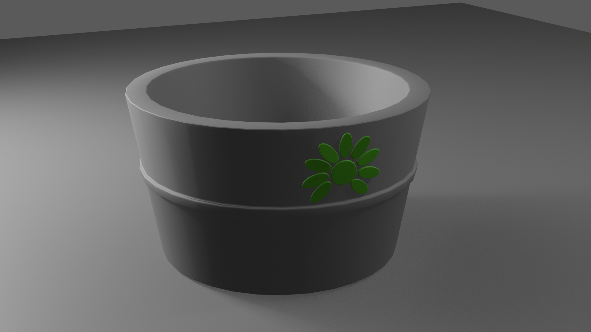
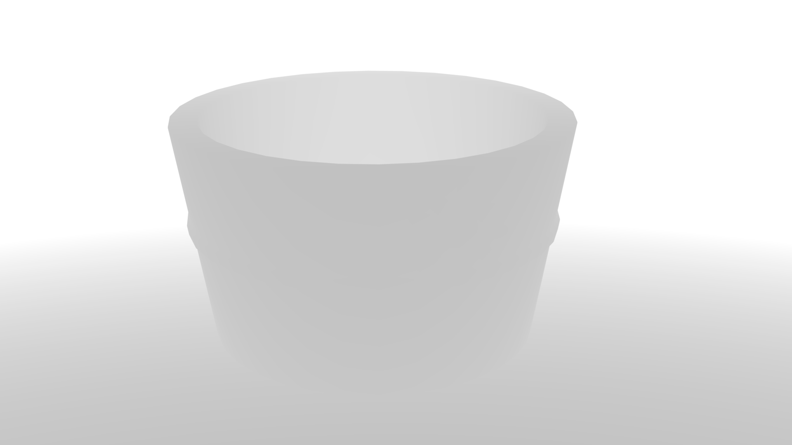
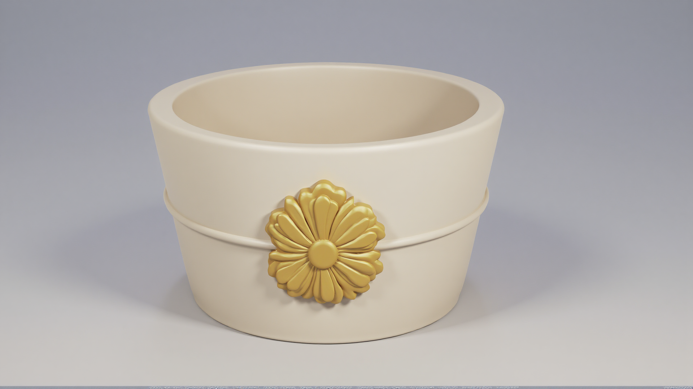
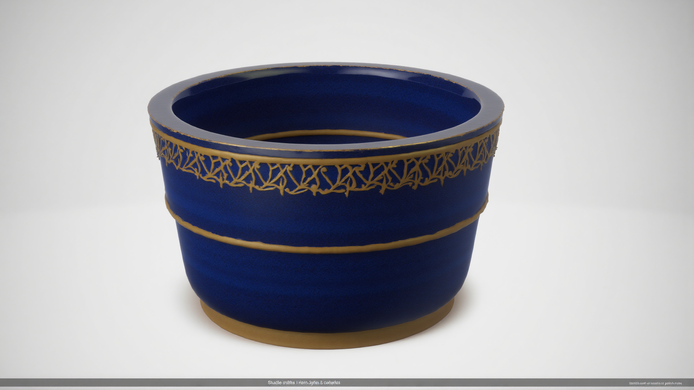
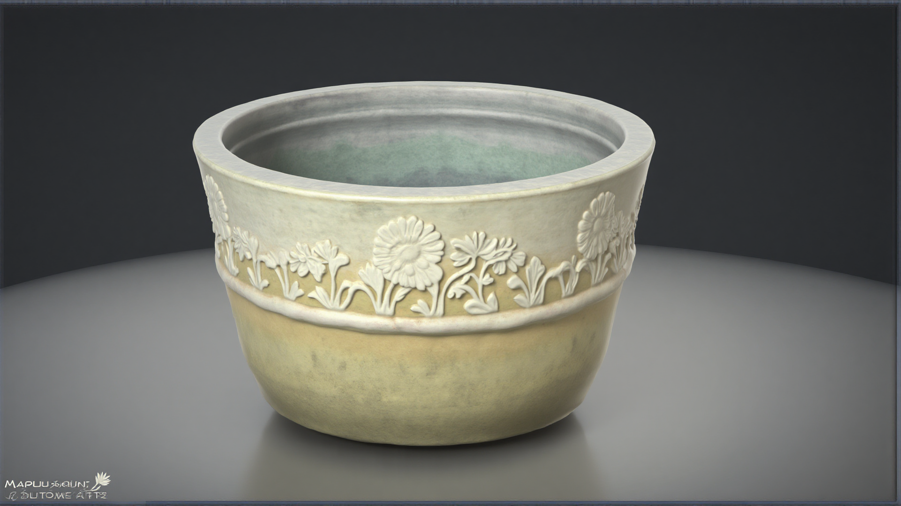

# BloomForge
## AI-Assisted Stylized Game Prop Pipeline

BloomForge is a self-directed technical art study exploring how artist-created Blender geometry and depth-conditioned generative AI can accelerate visual iteration while retaining structural control.

## Overview

This is not text-to-image asset generation from scratch. The workflow begins with authored 3D geometry and uses a geometry-derived depth image to guide visual exploration. The generated results are references for artist evaluation, not finished game assets.

## Pipeline

Blender Geometry → Geometry-Derived Depth → FLUX.1 Depth / ComfyUI → Visual Material Exploration → Artist Evaluation → Production Refinement

## Goals

Test where AI-assisted workflows can genuinely accelerate game-asset visual iteration, and identify where their control signals fall short. The aim is to keep the artist's geometry and judgment central to the process.

## Tools

- Blender
- ComfyUI
- FLUX.1 Depth Dev
- Git

## Experiment

I modeled an original planter in Blender and rendered a geometry-derived Mist/depth pass. In ComfyUI, the Mist image was inverted to the near-bright depth convention expected by the FLUX.1 Depth workflow, then used as structural conditioning. Material directions included neutral ceramic, blue glazed ceramic, and gold accents or ornamental treatments.

| Stage | Evidence |
| --- | --- |
| Authored Blender base render |  |
| Geometry-derived Mist control |  |
| First successful neutral ceramic exploration |  |
| Blue glazed ceramic and gold exploration |  |
| Flower-detail limitation |  |

## Results

Depth conditioning preserved the silhouette, overall proportions, taper, rim and cavity, camera perspective, and other large structural forms across the successful tests. It gave the material explorations a consistent base shape while leaving room for surface interpretation.

## Limitation discovered

The original planter included a shallow embossed flower ornament. The depth signal preserved the planter's macro geometry but did not reliably encode that shallow relief strongly enough to constrain the generative model. FLUX sometimes redesigned or replaced the ornament, as the example above shows.

This is a genuine limitation of the tested workflow, not something corrected artificially in the evidence. The controlled final experiment will therefore use a simplified prop without shallow surface relief, so the test matches the geometric information depth conditioning preserves reliably. That simplified asset is still in progress.

## What this demonstrates

- Critical evaluation of an emerging tool through repeatable visual tests.
- Integration of authored 3D geometry with a generative workflow.
- Attention to what the depth control signal contains, rather than treating generation as a black box.
- Preservation of artist control by using outputs as material references and identifying when traditional asset work remains necessary.

## Repository structure

- `blender/` — source Blender project.
- `comfyui/` — tested FLUX.1 Depth workflow JSON; model weights are not included.
- `renders/base/` — authored Blender beauty render.
- `renders/depth/` — geometry-derived Mist control image.
- `renders/generated/` — selected material explorations.
- `renders/experiments/` — setup trials and examples of the ornament limitation.
- `docs/` — experiment notes and image provenance.

## Status

Work in progress. The project will continue with a simplified controlled asset and additional material exploration.
